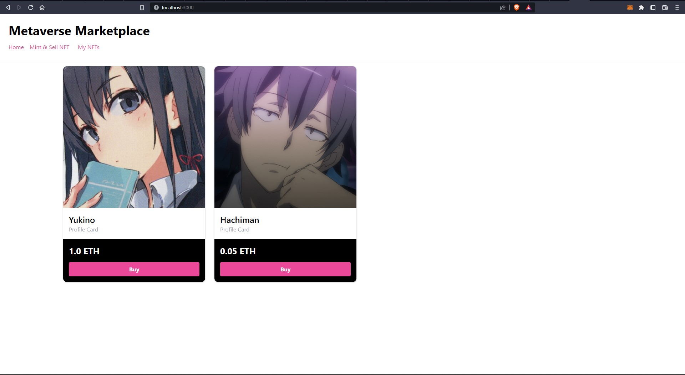

# NFT-Marketplace

## Description



This is a simple NFT marketplace built with Next.js, Hardhat, and IPFS. It allows users to mint their own NFTs and list them for sale. Users can also purchase NFTs listed for sale and resell them at a later date.

## Technologies
- Next.js
- Hardhat
- IPFS
- Solidity
- Infura
- Metamask

## Dependencies
- ethers
- hardhat
- @nomiclabs/hardhat-waffle
- @nomiclabs/hardhat-ethers
- ethereum-waffle
- chai
- web3modal
- @openzeppelin/contracts
- ipfs-http-client@50.1.2
- axios

## Setup
- Clone the repo
```bash
git clone
```

- Move into the main project directory
```bash
cd nft-marketplace
```

- Install dependencies
```bash
npm install
```

- Create a .env.local file in the root directory and add the following
```bash
NEXT_PUBLIC_project_Id = YOUR_INFURA_IPFS_PROJECT_ID
NEXT_PUBLIC_project_Secret = YOUR_INFURA_IPFS_PROJECT_SECRET
```

- Open three terminal windows and run the following commands in each
```bash
npx hardhat node
```
```bash
npx hardhat run scripts/deploy.js --network localhost
```
```bash
npm run dev
```

- Open http://localhost:3000/ to view the app

## Deployment

- To deploy to the Polygon Mumbai Testnet, you will need to create two .env file in the root directory and add the following

.secretAccount
```
PRIVATE_KEY_OF_ACCOUNT_WITH_MATIC
```

.secretProject
```
INFURA_PROJECT_ID
```

- To deploy to the Polygon Mumbai Testnet, run the following command
```bash
npx hardhat run scripts/deploy.js --network mumbai
```

- Replace the provider in the index.js file inside the loadNFTS() function with the following
```javascript
/* pages/index.js */

/* old provider */
const provider = new ethers.providers.JsonRpcProvider()

/* new provider */
const provider = new ethers.providers.JsonRpcProvider("https://rpc-mumbai.maticvigil.com")
```

## Demo

- Deployed contract on Polygon Mumbai Testnet using Infura RPC endpoint:  https://mumbai.polygonscan.com/address/0x31fa64d843a4e384ce3e6a68d078c67bef884221

- Contract Address: 0x31fa64d843a4e384ce3e6a68d078c67bef884221

You can use the above address instead of deploying your own contract to test the app, but you will have to replace the contract address in the config.js file with the above address, compile the NFTMarket.sol contract for it's abi and still replace the provider as shown above.